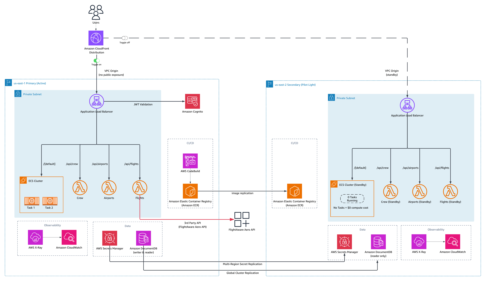

# Multi-Region Sample Application Architecture

A production-style reference implementation for building and operating a **Pilot Light disaster recovery architecture** using **AWS Application Recovery Controller (ARC) Region Switch**.

> [!NOTE]
> This project is intended as a learning reference and demo — not a production-ready template. Review all costs, IAM permissions, and architecture decisions before adapting for production use.

This project demonstrates how to design, deploy, and operate a multi-region AWS application with built-in disaster recovery — using an Airport Operations Dashboard called AirportHub as a realistic, tangible example. The focus is on the **resilience patterns**, not the application itself.

---

## Table of Contents

1. [Why This Exists](#why-this-exists)
2. [AirportHub — The Example Application](#airporthub--the-example-application)
3. [Architecture Overview](#architecture-overview)
4. [Project Structure](#project-structure)
5. [Resilience Patterns & Design Decisions](#resilience-patterns--design-decisions)
6. [ARC Region Switch Walkthrough](#arc-region-switch-walkthrough)
7. [RTO / RPO Targets & Tradeoffs](#rto--rpo-targets--tradeoffs)
8. [Deployment & Prerequisites](#deployment--prerequisites)
9. [Teardown](#teardown)
10. [References](#references)
11. [Security](#security)
12. [Contributing](#contributing)

---

## Why This Exists

Traditional disaster recovery relies on manual runbooks — ad-hoc steps that are error-prone, slow, and stressful under pressure. This project shows an alternative: a **declarative, repeatable failover plan** that orchestrates multi-service recovery in the right order, with human approval gates and parallelism where safe.

This is a hands-on reference for teams who want to understand:

- What Pilot Light DR looks like in practice across a real multi-service application
- How [AWS ARC Region Switch](https://docs.aws.amazon.com/r53recovery/latest/dg/what-is-route53-recovery.html) orchestrates failover across multiple microservices and third-party dependencies.
- How to keep secondary region compute costs near zero while still achieving a low RTO

---

## AirportHub — The Example Application

AirportHub is a sample multi-region Airport Operations Dashboard that serves as the vehicle for demonstrating the resilience patterns above. It gives airport executives a single real-time view of flights, crew assignments, and airport operations.

### What It Does

- **Flight Board** — live flight data via [FlightAware AeroAPI](https://www.flightaware.com/aeroapi/) (paid, optional)
- **Crew Operations** — crew assignment management (mock data)
- **Airport Directory** — airport information (static data, but you have the ability to add more airports)
- **Auth** — Amazon Cognito-backed login

### Stack

- **Frontend**: React (Vite), deployed via ECS Fargate + CloudFront
- **API Layer**: 3 [AWS Lambda](https://docs.aws.amazon.com/lambda/latest/dg/welcome.html) functions (airports, flights, crew) behind an ALB
- **Database**: Amazon DocumentDB (MongoDB-compatible)
- **Auth**: Amazon Cognito User Pool
- **FlightAware Scheduled Refresh**: EventBridge-triggered Lambda for hourly flight data refresh

### FlightAware Integration

> [!WARNING]
> **$$ Paid third-party service.**

The [FlightAware AeroAPI](https://www.flightaware.com/aeroapi/) key is used for on-demand and scheduled flight data refresh. The deploy script will prompt for the key — press Enter to skip and deploy with the scheduled refresh inactive. For setup details, see [docs/FLIGHTAWARE-API-KEY-GUIDE.md](docs/FLIGHTAWARE-API-KEY-GUIDE.md).

---

## Architecture Overview

The application is deployed across **two AWS regions (us-east-1 & us-east-2)** using an active/passive Pilot Light topology:
[](docs/generated-diagrams/airporthub-architecture-v2.png)

*Click the diagram to view full screen.*

---

| | us-east-1 (Primary) | us-east-2 (Pilot Light) |
|---|---|---|
| **ECS Fargate** | 3 tasks running | 0 tasks (deployed, idle) |
| **Lambda Functions** | Serving via ALB | Deployed, no traffic |
| **DocumentDB** | Global Cluster writer + reader | Secondary cluster (2 readers, continuous replication) |
| **Cognito** | User Pool (primary) | Not replicated
| **ECR Images** | Latest image | Cross-region replication enabled |
| **Scheduled Refresh** | Active (EventBridge) | Disabled |
| **Idle cost (secondary only)** | — | DocumentDB replica only — Lambda & ECS = **$0** |

> [!NOTE]
> Cognito is currently deployed in the primary region only and is **not replicated** to us-east-2. AWS now offers [Multi-Region Replication (MRR)](https://docs.aws.amazon.com/cognito/latest/developerguide/user-pool-multi-region.html) for Cognito User Pools, which creates a replica with shared user directory and Route 53-based automatic failover. In a real-world scenario, you would configure MRR with a Route 53 health check for automatic auth failover.

---

## Project Structure

```
.
├── airporthub-master.yaml          # CloudFormation parent stack (orchestrates all nested stacks)
├── deploy.py                       # Interactive deploy script
├── teardown.py                     # Standalone teardown script (handles failures, retries)
├── infrastructure/                 # CloudFormation nested stack templates
│   ├── network.yaml                #   VPC, subnets, NAT, security groups, VPC endpoints
│   ├── auth.yaml                   #   Cognito User Pool + App Client
│   ├── database.yaml               #   DocumentDB Global Cluster + regional clusters
│   ├── compute.yaml                #   ECS Fargate, ALB, ECR, CodeBuild, CloudFront
│   ├── api-services.yaml           #   Lambda functions (airports, flights, crew) + ALB rules
│   ├── observability.yaml          #   CloudWatch dashboard + alarms
│   └── arc-region-switch-plan.yaml #   ARC Region Switch DR plan
├── app/                            # ECS Flask application (serves React + proxies to DocumentDB)
│   ├── app.py
│   ├── auth.py
│   └── Dockerfile
├── frontend/                       # React SPA (Vite + TypeScript + Tailwind)
├── airport-service/                # Lambda: airport CRUD operations
├── flights-service/                # Lambda: flight data + FlightAware integration
├── crew-service/                   # Lambda: crew management (pilots, FAs, assignments)
├── scheduled-refresh-microservice/ # Lambda: EventBridge-triggered FlightAware refresh
├── custom-resources/               # CloudFormation custom resource Lambdas
│   └── data-seed/                  #   Seeds initial airport data on stack CREATE
├── data/                           # Static data files
│   ├── airport_data_generator.py   #   Generates seed airport JSON
│   └── global-bundle.pem           #   DocumentDB TLS CA bundle
└── docs/                           # Documentation
    ├── openapi.yaml                #   Full API specification (OpenAPI 3.0)
    ├── FLIGHTAWARE-API-KEY-GUIDE.md
    ├── Region-Switch-Failover.md   #   Failover operations runbook (ARC Region Switch)
    └── generated-diagrams/         #   Architecture diagram PNGs
```

---

## Resilience Patterns & Design Decisions

### Pilot Light (Active/Passive)

Per the [AWS Disaster Recovery Whitepaper](https://docs.aws.amazon.com/whitepapers/latest/disaster-recovery-workloads-on-aws/disaster-recovery-options-in-the-cloud.html#pilot-light), Pilot Light means:

- **Data is always replicated** — DocumentDB Global Cluster continuously replicates us-east-1 → us-east-2 with sub-second lag
- **Core infrastructure is deployed but switched off** — ECS exists in us-east-2 with 0 tasks; Lambda is deployed but receives no traffic. Both cost **$0 at idle** (Lambda is pay-per-use only; ECS charges nothing with 0 running tasks)
- **Failover requires activation** — unlike Warm Standby (traffic-ready immediately), Pilot Light needs orchestrated steps to "turn on" the recovery region

**Why Pilot Light and not Warm Standby?** Cost. With Pilot Light, the only ongoing secondary cost is the DocumentDB replica. ECS and Lambda in the secondary region cost $0 at idle. Warm Standby would require running ECS tasks continuously — appropriate for stringent RTOs.

### Infrastructure Stacks

The full environment is deployed as a single CloudFormation parent stack (`airporthub-master.yaml`) with nested stacks per layer:

| Stack | Resources |
|---|---|
| **Network** | VPC, subnets, NAT Gateways, security groups, VPC endpoints |
| **Auth** | Cognito User Pool + App Client |
| **Database** | DocumentDB Global Cluster, regional cluster, 2 instances |
| **Compute** | ECS Fargate service, ALB, ECR, CodeBuild, CloudFront |
| **API Services** | 3 Lambda functions (airports, flights, crew), data seed |
| **Observability** | CloudWatch dashboard + alarms |
| **ARC Plan** | Region Switch plan, custom Lambda helpers, FlightAware child plan |

### DocumentDB Global Cluster

The database is the centerpiece of the DR strategy. Key properties:

- **Continuous async replication** with sub-second lag from primary to secondary
- **`switchoverOnly` mode** in ARC — zero data loss, both clusters must be healthy before promotion proceeds
- **Secrets Manager auto-sync** — credentials replicate cross-region automatically; no manual secret rotation on failover
- **The bottleneck** — DocumentDB switchover (~5–10 minutes) is what drives the RTO estimate

### CloudFront as the Traffic Switch

CloudFront sits in front of both ALBs via [**VPC Origins**](https://aws.amazon.com/blogs/networking-and-content-delivery/introducing-cloudfront-virtual-private-cloud-vpc-origins-shield-your-web-applications-from-public-internet/) — a private connectivity path that routes traffic over AWS's internal backbone without exposing the ALBs to the public internet. An origin group wraps both VPC Origins (us-east-1 primary, us-east-2 secondary) and retries on 500/502/503/504 — no control plane API dependency needed. This aligns with [Reliability Pillar](https://docs.aws.amazon.com/wellarchitected/latest/reliability-pillar/rel_withstand_component_failures_avoid_control_plane.html) in AWS Well-Architected Framework.

> [!IMPORTANT]
> **Origin group failover only covers GET/HEAD/OPTIONS.** Write operations (`/api/*` paths) route directly to the primary origin and are unavailable during failover to us-east-2. This is an [AWS-documented limitation](https://docs.aws.amazon.com/AmazonCloudFront/latest/DeveloperGuide/RequestAndResponseBehaviorOriginGroups.html) — CloudFront does not fail over when the viewer sends POST, PUT, or DELETE. See [How CloudFront Failover Works](docs/Region-Switch-Failover.md#how-cloudfront-failover-works).

### ARC Region Switch — Replacing the Runbook

Rather than a wiki page of manual steps, the entire failover sequence is codified in an `AWS::ARCRegionSwitch::Plan` CloudFormation resource. This gives you:

- **Dependency ordering** — DocumentDB switches before compute activates
- **Human approval gates** — operators confirm database health before scaling up ECS, and confirm app health before cleanup
- **Parallel execution where safe** — ECS scale-up and CloudFront origin switch happen simultaneously to minimize RTO
- **Nested plan support** — a child plan (`flightaware-app-switchover`) manages the scheduled data refresh microservice independently, simulating microservice ownership boundaries
- **Symmetric failover/failback** — the same plan structure handles both directions

---

## ARC Region Switch Walkthrough

The plan is manually triggered by an authorized operator — there are no automatic triggers. Both failover and failback use the same 6-step structure.

### Failover: Activate us-east-2 (secondary region)

```
Step 1 — DocumentDB Global Cluster Switchover (10 min timeout)
         ├── Promote us-east-2 secondary → primary writer
         └── Behavior: switchoverOnly (zero data loss; requires both clusters healthy)

Step 2 — Seed Live Flight Data (5 min timeout)
         ├── Invoke Flights Lambda in the activating region
         ├── Fetches live data from FlightAware AeroAPI
         └── Writes to the newly promoted DocumentDB primary

Step 3 — 🔐 Manual Approval: FailoverApproval (10 min timeout)
         └── Operator confirms DB switchover + live data before activating compute

Step 4 — ECS Scale Up (us-east-2: 0 → production capacity, 10 min timeout)
         └── Uses sampledMaxInLast24Hours for target task count

Step 5 — 🔐 Manual Approval: FinalApproval (10 min timeout)
         └── Operator confirms application is healthy in us-east-2

Step 6 — Post-Failover Cleanup (Parallel)
         ├── Nested ARC Plan: FlightAware Switchover
         │   └── Enable EventBridge schedule in us-east-2, disable in us-east-1
         └── Scale Down Source ECS
             └── Set us-east-1 ECS desired count to 0 (returns to Pilot Light)
```

### Failback: Activate us-east-1

Identical 6-step structure in reverse — promotes us-east-1 back to primary, toggles the FlightAware schedule, and scales down us-east-2.

### FlightAware Child Plan

The `flightaware-app-switchover` stack deploys a separate ARC plan whose sole responsibility is toggling the EventBridge-scheduled data refresh. It is invoked by the parent plan's Step 6 via an `ARCRegionSwitchPlan` block type, demonstrating how ARC supports **nested plan composition** to model microservice ownership.

### ARC Human Approval — Important Setup Note

During deployment, `deploy.py` prompts for an IAM role ARN authorized to approve plan steps. ARC requires the **full ARN including the IAM path**. SSO roles include the path `/aws-reserved/sso.amazonaws.com/` which must be present — using a short ARN causes `AccessDeniedException` when approving steps.

```bash
# Step 1: Get your current role name
aws sts get-caller-identity
# Returns: arn:aws:sts::ACCOUNT:assumed-role/ROLE_NAME/session

# Step 2: Get the full ARN with IAM path
aws iam get-role --role-name ROLE_NAME --query 'Role.Arn'
# Returns: arn:aws:iam::ACCOUNT:role/aws-reserved/sso.amazonaws.com/ROLE_NAME
```

---

## RTO / RPO Targets & Tradeoffs

| Metric | Target | Driver |
|---|---|---|
| **RTO** | 15 minutes | DocumentDB switchover (~5–10 min) + ECS startup + human approval gates |
| **RPO** | Near-zero | Continuous async replication via DocumentDB Global Cluster; sub-second lag in steady state |

---


---

## Deployment & Prerequisites

### Prerequisites

- AWS CLI v2 configured with admin credentials
- Python 3.9+ with pip3
- Permissions to deploy resources in both **us-east-1** and **us-east-2**

### Deploy

```bash
# Clone the repo
git clone https://github.com/aws-samples/sample-multi-region-application-architecture.git && cd sample-multi-region-application-architecture

# Deploy (interactive — will prompt for FlightAware key and ARC approval role ARN)
python3 deploy.py

# Or with explicit profile
python3 deploy.py --profile my-profile
```

The deploy script handles everything in order:
1. Install Lambda dependencies (pip3)
2. Create S3 bucket for CloudFormation template storage
3. Package and upload nested stacks
4. Deploy the master stack (us-east-1)
5. Build the container via CodeBuild (no local Docker required)
6. Deploy the secondary region (us-east-2)
7. Deploy the FlightAware microservice (both regions)
8. Set up the ARC Region Switch recovery plan

> [!NOTE]
> **Total deployment time is over 1 hour.** The stack provisions full infrastructure across two regions (VPC, DocumentDB Global Cluster, ECS, Lambda, ARC plans). Grab a coffee.

---

## Teardown

> [!WARNING]
> **Tear down promptly when not in use.** This demo deploys resources across two regions that incur ongoing costs. The primary ongoing cost is the **DocumentDB Global Cluster** running in both regions.

```bash
# Recommended: standalone teardown script (handles VPC endpoints, ECR images, retry logic)
python3 teardown.py --profile my-profile

# Preview what would be deleted without taking action
python3 teardown.py --profile my-profile --dry-run

# Skip confirmation prompt
python3 teardown.py --profile my-profile --yes

# Legacy (delegates to teardown.py)
python3 deploy.py --teardown --profile my-profile
```

The teardown script auto-discovers all AirportHub resources by prefix, handles common deletion blockers (VPC endpoint ENIs, ECR images, DocumentDB global cluster ordering), and retries on failure.

---

## References

- [AWS DR Whitepaper — Pilot Light](https://docs.aws.amazon.com/whitepapers/latest/disaster-recovery-workloads-on-aws/disaster-recovery-options-in-the-cloud.html#pilot-light)
- [AWS::ARCRegionSwitch::Plan CloudFormation Reference](https://docs.aws.amazon.com/AWSCloudFormation/latest/TemplateReference/AWS_ARCRegionSwitch.html)
- [ARC Region Switch Plan Trust Policy](https://docs.aws.amazon.com/r53recovery/latest/dg/security_iam_region_switch_trust_policy.html)
- [DocumentDB Global Cluster Disaster Recovery](https://docs.aws.amazon.com/documentdb/latest/developerguide/global-clusters-disaster-recovery.html)
- [AWS Well-Architected](https://docs.aws.amazon.com/wellarchitected/latest/framework/reliability.html)

---

## Security

See [CONTRIBUTING](CONTRIBUTING.md#security-issue-notifications) for information on reporting security issues.

## Contributing

We welcome contributions! Please read [CONTRIBUTING.md](CONTRIBUTING.md) before submitting pull requests or issues.

## License

This library is licensed under the MIT-0 License. See the [LICENSE](LICENSE) file.
