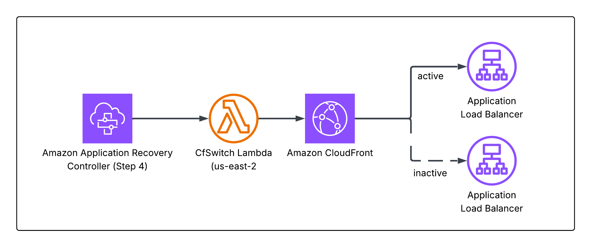

# Failover Operations Guide — ARC Region Switch

This document is the **operator runbook** for executing and managing ARC Region Switch failovers. For architecture details and design decisions, see the [main README](../README.md#arc-region-switch-walkthrough).

---

## Quick Reference

| | |
|---|---|
| **DR Pattern** | Pilot Light (Active/Passive) |
| **Primary Region** | us-east-1 (N. Virginia) |
| **Recovery Region** | us-east-2 (Ohio) |
| **RTO Target** | 15 minutes |
| **RPO Target** | Near-zero (DocumentDB Global Cluster continuous replication) |
| **Trigger** | Manual — operator-initiated from ARC console |
| **Plan Name** | `airporthub-region-switch` |
| **Execution Reports** | S3 bucket: `airporthub-arc-reports-<ACCOUNT_ID>` |

---

## How to Start a Failover

### From the AWS Console

1. In the AWS Console, **navigate to the Region you want to activate** (us-east-2 for failover, us-east-1 for failback)
2. Open **Application Recovery Controller** > **Region switch**
3. Select the `airporthub-region-switch` plan
4. Choose **Execute plan**
5. If prompted, approve manual steps as they come up (see [Approving Manual Gates](#approving-manual-gates) below)

### From the CLI

```bash
aws arc-region-switch start-plan-execution \
  --plan-arn <PLAN_ARN> \
  --target-region us-east-2
```

> **Note**: The plan ARN is output by the `airporthub-arc-plan` CloudFormation stack. Retrieve it with:
> ```bash
> aws cloudformation describe-stacks \
>   --stack-name airporthub-arc-plan \
>   --query 'Stacks[0].Outputs[?OutputKey==`PlanArn`].OutputValue' \
>   --output text
> ```

---

## Plan Steps & Timeouts

Both failover and failback follow a 6-step structure. Step names differ slightly per direction.

| Step | Action | Timeout | Retry Interval |
|---|---|---|---|
| 1 | DocumentDB Global Cluster Switchover | 10 min | — |
| 2 | Seed Live Flight Data (FlightAware Lambda) | 5 min | 5 min |
| 3 | **Manual Approval** | 20 min | — |
| 4 | Parallel: ECS Scale Up + CloudFront Origin Switch | 10 min (ECS), 5 min (CF) | 2 min (CF) |
| 5 | **Manual Approval** | 20 min | — |
| 6 | Parallel: FlightAware Child Plan + Scale Down Source ECS | 60 min | 10 min (scale-down) |

### Step Names by Direction

| Step | Failover (activate us-east-2) | Failback (activate us-east-1) |
|---|---|---|
| 3 | `FailoverApproval` | `FailbackApproval` |
| 5 | `FinalApproval` | `FinalApprovalFailback` |
---

## Approving Manual Gates

Steps 3 and 5 pause execution and wait for an authorized operator to approve. Approval is done through the AWS Console.

### Console Walkthrough

1. In **Application Recovery Controller** > **Region switch**, select the `airporthub-region-switch` plan
2. Click the active **Execution ID** in the Executions section
3. The step with a **Pending approval** badge is waiting for you
4. Click the pending step, review preceding results, then choose **Approve** or **Decline**
5. Execution resumes automatically within seconds of approval

### What to Verify Before Step 3 Approval

- [ ] DocumentDB switchover completed — check DocumentDB console in target region shows cluster role as **Writer**
- [ ] Flight data seed Lambda (Step 2) shows **Succeeded** in the execution timeline
- [ ] Secrets Manager replica shows status **InSync** in the target region

### What to Verify Before Step 5 Approval

- [ ] ECS service in target region shows desired task count running (ECS console > Clusters > `airporthub-cluster` > Service)
- [ ] CloudFront origin updated — CloudFront console > Distribution > Origins tab shows target region ALB
- [ ] Health check passes — `https://<cloudfront-domain>/api/health` returns `{"status": "healthy"}`

### What Happens If You Decline

Declining an approval gate **stops the execution immediately**. The system does NOT roll back — whatever steps completed before the gate remain in effect. For example:

- If you decline at Step 3: DocumentDB has already switched over but compute is still in the old region. You would need to start a new execution targeting the original region to reverse Step 1.
- If you decline at Step 5: ECS is scaled up and CloudFront is switched, but cleanup (Step 6) won't run. You'd need to manually scale down the source ECS or start a new failback execution.

### Timeout Behavior

If an approval gate is not approved or declined within **20 minutes**, the execution fails. You can investigate and start a new execution from the plan page.

### Who Can Approve

The operator must be signed in with the IAM role specified as `ApprovalRoleArn` during deployment. For SSO roles, the full IAM path is required:

```bash
# Get your role's full ARN (including IAM path)
aws sts get-caller-identity
# → arn:aws:sts::ACCOUNT:assumed-role/ROLE_NAME/session

aws iam get-role --role-name ROLE_NAME --query 'Role.Arn'
# → arn:aws:iam::ACCOUNT:role/aws-reserved/sso.amazonaws.com/ROLE_NAME
```

Using a short ARN (without the `/aws-reserved/sso.amazonaws.com/` path) causes `AccessDeniedException`.

---

## How CloudFront Origin Switch Works

The CloudFront switch Lambda (Step 4) updates the distribution's single origin in-place by swapping both the **VPC Origin ID** and the **ALB domain name** to point to the target region. Both regions have a pre-created VPC Origin (named `airporthub-vpc-origin-<region>`) pointing to their internal ALB. The Lambda looks up the target ALB DNS, resolves the target VPC Origin ID by name, then calls `UpdateDistribution` to apply both changes.

[](generated-diagrams/CFSwitch.png)

This is instant (no DNS TTL) because CloudFront VPC Origins route over AWS's internal backbone — the ALBs are never exposed to the public internet.

---

## Execution Reports

Every plan execution generates a report with step-by-step timing, success/failure status, and error details. Use these for post-incident review and RTO measurement.

**To view execution history in the console:**

1. Open **Application Recovery Controller** > **Region switch** in the [AWS Console](https://console.aws.amazon.com)
2. Select the `airporthub-region-switch` plan
3. Choose the **Plan execution history** tab to see all past executions
4. Click an **Execution ID** to view step-by-step progress and results

Reports are also automatically delivered to S3 at `s3://airporthub-arc-reports-<ACCOUNT_ID>/` for programmatic access, compliance evidence, or long-term retention.

---

## Call for action

- [Execute a Region Switch Plan](https://docs.aws.amazon.com/r53recovery/latest/dg/plan-execution-rs.html)
- [AWS::ARCRegionSwitch::Plan CloudFormation Reference](https://docs.aws.amazon.com/AWSCloudFormation/latest/TemplateReference/AWS_ARCRegionSwitch.html)
- [ARC Region Switch Plan Trust Policy](https://docs.aws.amazon.com/r53recovery/latest/dg/security_iam_region_switch_trust_policy.html)
- [DocumentDB Global Cluster DR](https://docs.aws.amazon.com/documentdb/latest/developerguide/global-clusters-disaster-recovery.html)
- [ARC Region Switch Pricing](https://aws.amazon.com/application-recovery-controller/pricing/)
